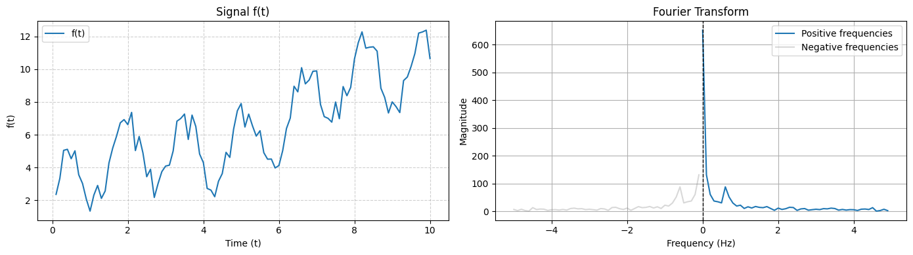

# Fourier-Analysis
In this notebook, we perform a complete Fourier analysis of a time series. The main objective is to decompose the signal into its constituent frequency components using the Fourier Transform, identify and filter out unwanted frequencies.

## Filtering using intervals of frequencies

If we have an interval of frequencies $\Omega = (\omega_1, \omega_2)$ that is relevant, for instance, the frequencies that represent a sesonality, or the ones that represent the noise. We can filter $F(\omega)$ by defining a new function $\hat{F}(\omega)$ that:

$$
\hat{F}(\omega)
\begin{cases}
F(\omega) & \text{if}\; \omega \in \Omega \\
0 & \text{if}\; \omega \notin \Omega
\end{cases}
$$

We can return to the time domain by using the Inverse Fourier Transform. As we can see, the Inverse Fourier Transform of $\hat{F}(\omega)$ is nothing more than the Inverse Fourier Transform of $F(\omega)$ in our interval of interest $\Omega$:

$$\psi(t) = \frac{1}{2\pi} \int_{-\infty}^{\infty} \hat{F}(\omega) \, e^{i \omega t} \, d\omega = \frac{1}{2\pi} \left( \int_{\mathbb{R} ∖ \Omega} \hat{F}(\omega) \, e^{i \omega t} \, d\omega + \int_{\Omega} \hat{F}(\omega) \, e^{i \omega t} \, d\omega\right) = \frac{1}{2\pi} \left( 0 + \int_{\Omega} F(\omega) \, e^{i \omega t} \, d\omega \right)$$

$$\psi(t) = \frac{1}{2\pi} \int_{\Omega} F(\omega) \, e^{i \omega t} \, d\omega$$

In the case of having multiple intervals of interest, we can reconstruct the complete time series with all the relevant information:

$$\psi(t) = \psi_1(t) + \psi_2(t) + \cdots + \psi_n(t) = \sum_i \psi_i(t)$$

$$\sum_i \psi_i(t) = \frac{1}{2\pi} \left( \int_{\Omega_1} F(\omega) \, e^{i \omega t} \, d\omega + \int_{\Omega_2} F(\omega) \, e^{i \omega t} \, d\omega + \cdots + \int_{\Omega_n} F(\omega) \, e^{i \omega t} \, d\omega \right) = $$

$$\psi(t) = \sum_i \psi_i(t) =  \frac{1}{2\pi} \int_{\bigcup_i \Omega_i} F(\omega) \, e^{i \omega t} \, d\omega$$

## Finding the intervals of frequency automatically
We can see that a frequency is relevant if there is a significant variation of the magnitude $A(\omega)$, so we can compute its derivative:

$$A(\omega) = \left | F(\omega) \right | = \sqrt{F(\omega) \, F^*(\omega)} \quad \rightarrow \quad \frac{dA}{d\omega} = \Re \left \{ \frac{F^*(\omega)}{\left | F(\omega) \right |} \frac{dF}{d\omega} \right \}$$

$$\frac{dF}{d\omega} = \frac{d}{d\omega} \int_{-\infty}^{\infty} f(t) \, e^{-i \omega t} \, dt = -i \int_{-\infty}^{\infty} t\, f(t) \, e^{-i \omega t} \, dt = -i \, \mathcal{F}\{ t \, f(t)\}$$

A way of determine if a change is big enough is normalizing the derivative and comparing it with a threshold $\tau$:
$$\frac{1}{H_{max}}\left |\frac{dA}{d\omega} \right | \ge \tau \quad \rightarrow \quad \left |\frac{dA}{d\omega} \right | \ge H_{max} \, \tau \quad \quad \tau \in [0, 1]$$
Since $A(\omega)$ is always positive:
$$H_{max} = \max(A(\omega), 0)$$
Higher values of $\tau$ means less and bigger intervals (there are variations that are less than $\tau$ so those frequencies are considered in the same interval), whereas lower values of $\tau$ generates more and smaller intervals (almost every variation is greater than $\tau$ so it creates another interval).

